## Overview

The proliferation of event-driven microservices has transformed distributed system design, delivering unprecedented scalability, resilience, and real-time responsiveness across cloud-native architectures. Yet, as these systems span globally distributed event hubs, they confront formidable challenges in global event processing—most notably variable network latency, cross-region replication delays, and heterogeneous messaging infrastructures that amplify the risk of ordering violations and partial failures. Central to these difficulties is the inherent complexity of guaranteeing exactly-once semantics: at-least-once delivery risks duplicate side effects, while at-most-once approaches invite data loss, both undermining application correctness under failure. These issues are further entangled with fundamental distributed consistency trade-offs, where the CAP theorem and PACELC models compel architects to sacrifice either strong consistency or high availability during network partitions. In response, a suite of architectural patterns has emerged to enable reliable event processing, including outbox tables, change-data-capture streams, saga orchestrations, and exactly-once delivery protocols. This work demonstrates that achieving exactly-once processing across globally distributed event hubs requires a combination of idempotent processing, transactional messaging, and deterministic state management. When rigorously composed, these techniques deliver fault-tolerant, globally consistent event-driven systems without compromising throughput or availability.

## The rise of event-driven system

The evolution of software architectures has progressively addressed the demands for greater agility, scalability, and maintainability in increasingly complex distributed systems.
Traditional monolithic architectures centralized all business logic, user interface, and data access within a single deployable unit. While straightforward to develop and deploy initially, monoliths suffer from tight coupling, scalability bottlenecks (requiring vertical scaling of the entire application), and slow release cycles due to the risk of widespread regression from small changes.

Service-Oriented Architectures (SOA) introduced modularity by decomposing applications into reusable services, typically orchestrated through an Enterprise Service Bus (ESB) for synchronous communication via protocols like SOAP. SOA improved reuse and separation of concerns but often led to centralized governance overhead, performance penalties from synchronous calls, and complex point-to-point integrations.

Microservices refined this further by emphasizing independently deployable, loosely coupled services aligned to bounded contexts, communicating primarily through lightweight protocols (e.g., REST/HTTP or gRPC). This enabled independent scaling, polyglot persistence, and faster delivery by autonomous teams. However, synchronous request-response patterns created cascading failures, tight temporal coupling, and increased operational complexity in failure handling and tracing.

The latest progression—event-driven microservices—shifts communication to asynchronous, event-based patterns. Services produce events representing significant state changes (e.g., "OrderPlaced", "PaymentProcessed") and consume relevant events without direct knowledge of downstream consumers. This decouples producers from consumers in both time and space, enabling true reactivity and resilience.

**Event-driven systems are experiencing explosive growth due to several compelling advantages**:

Real-time responsiveness — Systems react immediately to changes, supporting low-latency experiences in dynamic environments.

High scalability — Asynchronous processing allows horizontal scaling of producers and consumers independently, handling massive throughput without bottlenecks.

Asynchronous communication — Eliminates blocking calls, improving resource utilization and fault isolation.

Decoupled services — Teams evolve services autonomously, reducing coordination overhead and enabling innovation at pace.

**Prominent use cases illustrate the power of this paradigm**:

**Financial transactions** — Real-time fraud detection, payment settlement, and ledger updates across distributed ledgers.

**E-commerce order pipelines** — Coordinating inventory reservation, payment processing, shipping, and customer notifications without synchronous dependencies.

**IoT telemetry processing** — Ingesting and reacting to sensor data streams at massive scale for predictive maintenance or anomaly detection.

**Streaming analytics platforms** — Enabling continuous computation over event streams for dashboards, recommendations, and alerting.

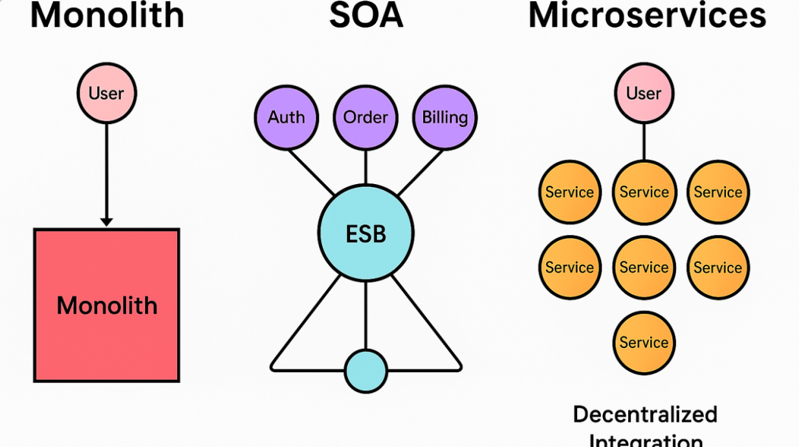


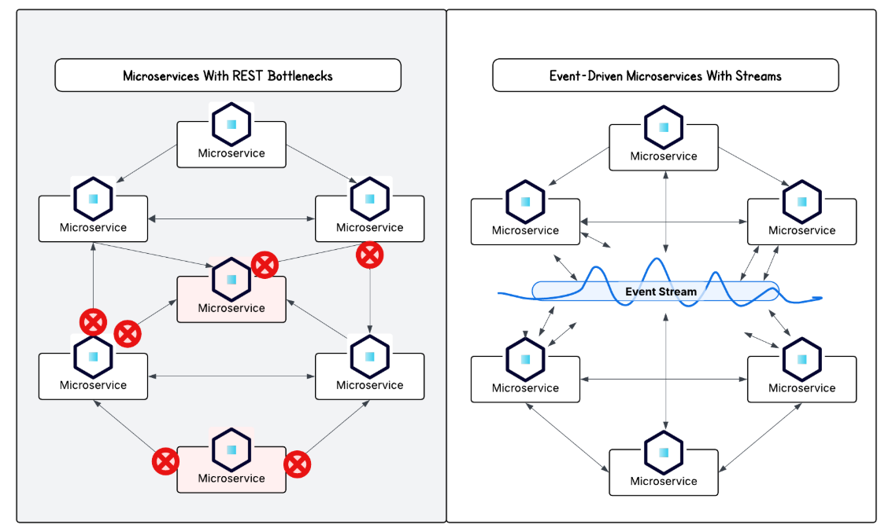

A canonical view of event-driven microservices involves producers publishing events to a global event hub (e.g., Kafka, Azure Event Hubs, or Pulsar), which durable stores and distributes them to multiple consumer services. Consumers maintain their own state stores (databases, caches, or materialized views) updated deterministically from event streams.

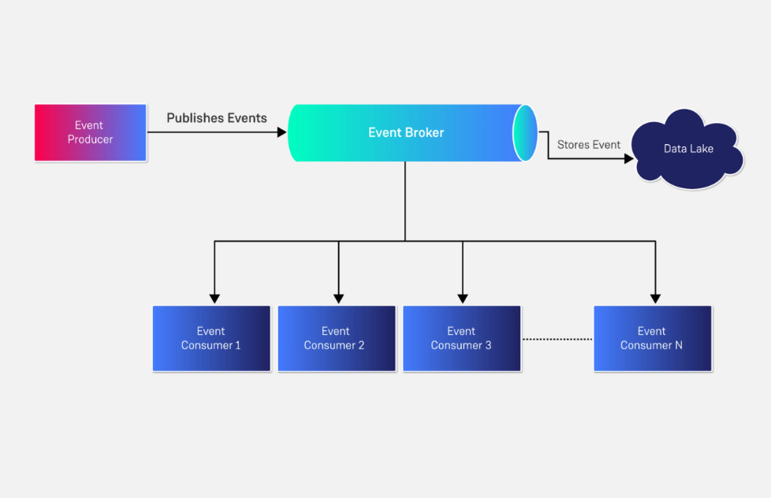

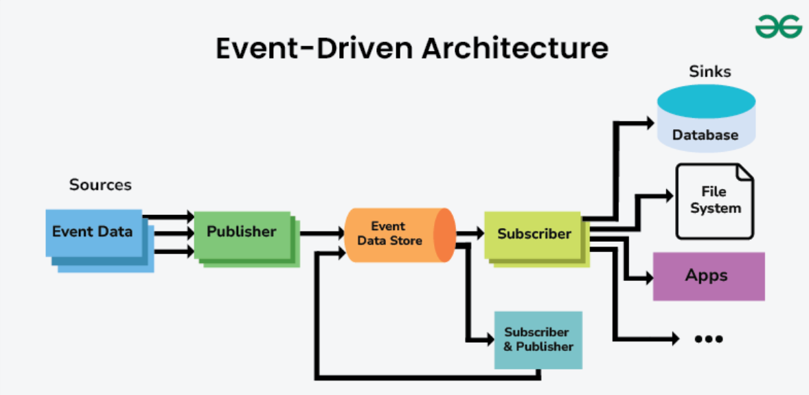

This architecture—producers → global event hub → consumer services + state stores—forms the foundation for reliable, globally distributed event processing while preserving loose coupling and high throughput.

**Challenges of Event Sourcing**

While event sourcing provides powerful advantages—such as complete auditability, temporal querying, and natural support for complex business domains—it introduces significant engineering challenges, particularly in distributed, globally scaled event-driven microservices architectures.
One of the foremost difficulties is increased system complexity. Event sourcing replaces simple CRUD operations with an append-only event log, requiring developers to model changes as immutable domain events, implement event handlers (projections), manage event versioning, and handle schema evolution. This creates a steeper learning curve and higher cognitive load compared to traditional persistence models. Teams often face overengineering risks when applying the pattern to simple domains where relational databases suffice, leading to unnecessary plumbing code and maintenance overhead.

Storage and performance concerns arise from the immutable, append-only nature of the event store. Event streams grow indefinitely without natural compaction, resulting in high disk usage over time. Rebuilding current state by replaying potentially millions of events for an aggregate can be computationally expensive, especially during recovery, scaling, or projection rebuilding. Snapshots mitigate this by checkpointing state periodically, but they introduce their own consistency and invalidation challenges in distributed environments.

Eventual consistency and read-model synchronization pose substantial hurdles in distributed systems. Read models (materialized views) are updated asynchronously from the event stream, leading to temporary discrepancies between command (write) and query (read) sides. In globally distributed setups, replication lag, network partitions, and out-of-order delivery exacerbate stale reads or reconciliation delays. Ensuring projections remain eventually consistent across regions requires careful idempotency and deduplication logic.

Concurrency control and distributed transactions become more intricate without traditional database ACID guarantees. Optimistic concurrency via event versioning or sequence numbers helps prevent lost updates, but handling conflicts across microservices demands patterns like sagas or compensating transactions. True distributed transactions are avoided in favor of eventual consistency, trading immediate global atomicity for availability and partition tolerance—aligning with CAP theorem constraints but complicating business logic that expects strong consistency (e.g., financial holds or inventory reservations).

Event ordering, duplication, and exactly-once processing are notoriously difficult to guarantee at global scale. Messaging infrastructures may deliver events at-least-once, introducing duplicates that must be handled idempotently. Out-of-order arrival due to partitioned topics or cross-region replication can violate causal dependencies unless mitigated by deterministic processing, correlation IDs, or vector clocks. Achieving exactly-once semantics across distributed event hubs demands a careful composition of idempotent consumers, transactional outbox patterns, and deterministic state reconstruction—precisely the combination advocated in reliable event processing architectures.

Schema evolution and immutability tension further complicate long-lived systems. Once persisted, events are immutable; correcting modeling mistakes or adapting to new requirements often requires upcasting, versioning strategies, or in-place transformations—each carrying risks of breaking downstream projections or requiring full stream replays. Data privacy regulations (e.g., GDPR "right to be forgotten") conflict with the append-only log, necessitating techniques like event redaction or separate anonymized streams.

In globally distributed event-driven systems, these challenges compound: variable latencies, heterogeneous infrastructures, and partial failures amplify risks of inconsistencies, debugging complexity ("distributed debugging hell"), and operational toil. While patterns such as snapshots, idempotency, transactional messaging, and deterministic projections address many issues, event sourcing demands disciplined design and mature operational practices to deliver its promised resilience and auditability without overwhelming development velocity.

**Mitigation Strategies for Challenges in Event Sourcing**

Event sourcing, while powerful for auditability, resilience, and complex domain modeling in distributed event-driven microservices, demands targeted mitigation strategies to address its core challenges—particularly in globally distributed environments. Below, we outline proven architectural and operational techniques that tame complexity, ensure reliability, and preserve performance without sacrificing the pattern's strengths.

**Managing increased system complexity**

Adopt disciplined domain-driven design (DDD) practices to apply event sourcing selectively to high-value aggregates with rich behavior or audit requirements, avoiding it for simple CRUD domains. Use established frameworks (e.g., EventStoreDB, Axon, Marten, or Kafka Streams with state stores) that abstract much of the plumbing—event serialization, versioning, projection building, and subscription management. Invest in comprehensive documentation, Architectural Decision Records (ADRs), and team training to flatten the learning curve and prevent overengineering.

**Addressing storage growth and replay performance**

Implement periodic snapshots of aggregate state at configurable thresholds (e.g., every 100–1000 events or based on time/ size). Snapshots serve as checkpoints: during recovery or projection rebuilds, load the latest snapshot and replay only subsequent events, dramatically reducing CPU and I/O costs. Complement snapshots with event compression for archival streams (e.g., gzip or domain-specific delta encoding) and tiered storage policies—keep hot recent events in fast storage while archiving cold historical data to cheaper object stores.

**Handling eventual consistency and read-model synchronization**

Embrace eventual consistency as the default for scalability, but provide stronger guarantees where business-critical (e.g., via synchronous projections for read-your-writes scenarios or tightly coupled command/query sides within the same bounded context). Use idempotent projections and at-least-once processing with deduplication to tolerate duplicates and out-of-order events. Employ correlation IDs, causation IDs, and vector clocks to preserve causal ordering across services. For global distribution, leverage multi-region event replication with conflict-free replicated data types (CRDTs) or deterministic merge functions in downstream consumers.

**Ensuring concurrency control and avoiding distributed transactions**

Favor optimistic concurrency control using event stream versioning or expected version checks: load the current stream version, compute new events, and append only if the version matches (compare-and-swap semantics supported natively by most event stores). For cross-aggregate invariants, use sagas (orchestrated or choreographed) with compensating actions rather than 2PC. When set-based constraints are required (e.g., unique usernames), enforce them either transactionally within a single stream or via dedicated validation streams/ tables updated atomically with events.

**Achieving reliable exactly-once processing**

Combine idempotent consumers (using unique operation/ idempotency keys in events or deduplication tables tracking processed message IDs) with transactional outbox patterns to atomically persist business events alongside state changes. Use deterministic state management—pure functions for projections and reproducible replay—to eliminate non-determinism. In distributed setups, leverage messaging systems with exactly-once guarantees (where available, e.g., Kafka idempotent producers + transactional consumers) or implement custom deduplication at the application level.

**Navigating schema evolution and immutability**

Employ upcasting (read-time transformation): register chained upcasters that convert legacy event versions to the current schema during replay or projection, preserving historical data immutably while allowing code to work with modern structures. For additive changes, use weak/ flexible schemas (e.g., JSON with optional fields). For breaking changes, introduce new event types and dual-write during transition periods, or use anti-corruption layers (ACLs) to translate between old and new models. Maintain clear versioning conventions and test upcasters thoroughly against historical replays to avoid subtle bugs.

**Additional operational mitigations for global distribution**

Implement distributed tracing (e.g., OpenTelemetry) end-to-end across event flows to debug "distributed debugging hell" and trace causality.

Use caching layers (e.g., Redis) for hot read models to mask projection lag.
Design for partition tolerance with retry mechanisms, dead-letter queues, and circuit breakers on consumers.

Regularly test disaster recovery by replaying production-like event volumes from backups.

When composed thoughtfully, these strategies transform event sourcing from a high-risk pattern into a robust foundation for globally consistent, fault-tolerant systems—delivering the audit trail, temporal flexibility, and resilience promised by the approach while controlling operational complexity and cost.

**Message Delivery Semantics**

In event-driven microservices, particularly those leveraging global event hubs, the semantics of message (event) delivery fundamentally determine system reliability, correctness, and operational complexity. These semantics define how many times an event is delivered and processed, directly influencing failure modes and the strategies needed to achieve end-to-end guarantees. This section examines the three primary delivery semantics, their inherent risks, and trade-offs, building toward the techniques required for exactly-once processing.

**At-most-once**

Events are delivered zero or one time. The producer sends the event, and if delivery fails (e.g., due to network issues or broker unavailability), the event is dropped without retry.

Risk: Message loss. Critical business events (e.g., payment confirmations or inventory deductions) may never reach consumers, leading to data inconsistencies, lost revenue, or incorrect state.

This semantic prioritizes low latency and simplicity, making it suitable for non-critical telemetry or logging where occasional loss is tolerable.

**At-least-once**

Events are delivered one or more times. Producers retry on failure, and consumers acknowledge only after successful processing, ensuring no loss even under transient failures or restarts.
Risk: Duplicate processing. Retries or redeliveries can cause the same event to be processed multiple times, triggering unintended side effects (e.g., double-charging a customer or sending duplicate notifications).

This is the default in most durable messaging systems (e.g., Kafka without transactions, RabbitMQ with acknowledgments) and offers strong reliability at moderate complexity, provided duplicates can be tolerated or mitigated.

**Exactly-once**

Events are processed once and only once, even in the presence of failures, retries, network issues, or broker restarts. No loss and no duplicates occur from the application's perspective.
This is the gold standard for modern distributed systems—especially in financial, e-commerce, and stateful streaming applications—where correctness is non-negotiable. Achieving it requires coordinated mechanisms across producers, brokers, and consumers.

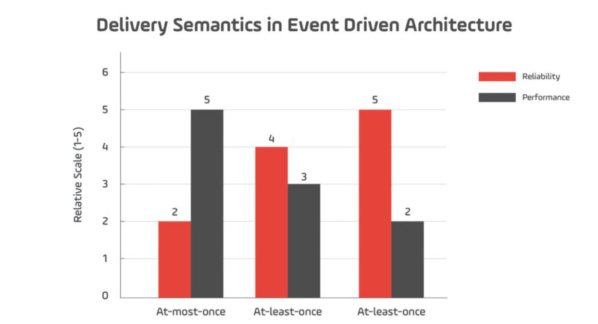

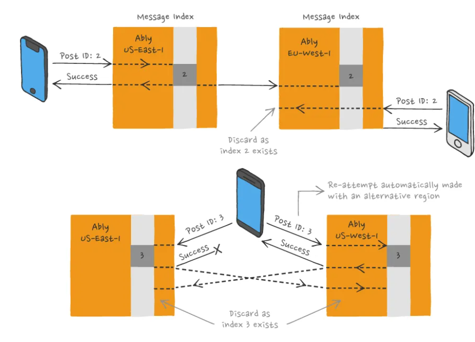

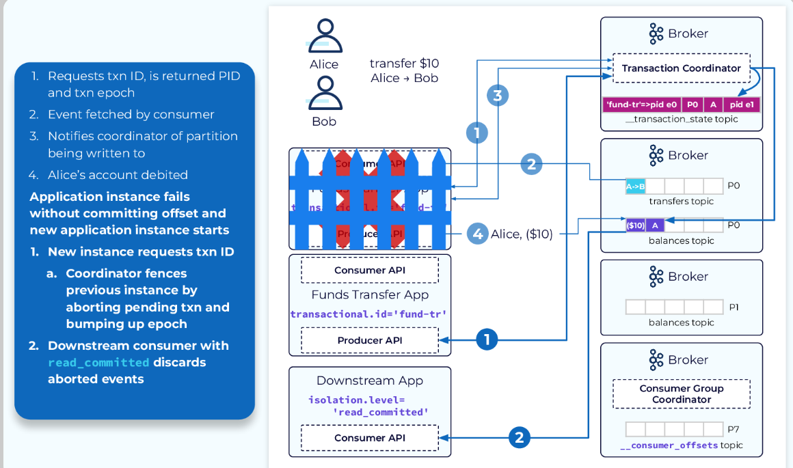

The following comparison highlights the trade-offs:


| Delivery Guarantee | Primary Risk            | Complexity | Typical Use Cases                                      | Performance Impact                    |
|--------------------|-------------------------|------------|--------------------------------------------------------|---------------------------------------|
| At-most-once       | Message loss            | Low        | Non-critical logging, metrics, fire-and-forget         | Highest (minimal overhead)            |
| At-least-once      | Duplicate processing    | Moderate   | Most event-driven systems with idempotency             | High (retries add overhead)           |
| Exactly-once       | Minimal (none ideal)    | High       | Financial transactions, order processing, inventory    | Moderate to lower (coordination cost) |

Exactly-once semantics impose the highest complexity because they demand end-to-end coordination: producers must deduplicate on send (e.g., via idempotent producers), brokers must support transactional commits, and consumers must process deterministically while acknowledging precisely once. Systems like Kafka achieve this through idempotent producers, transactional APIs, and read-committed isolation, but global distribution adds challenges like cross-region replication and failure isolation.

These semantics set the stage for reliable event processing patterns—idempotent consumers, transactional outbox, and deterministic state management—that compose to deliver exactly-once guarantees across distributed event hubs without compromising scalability or availability.

**Real-World Case Studies**

To ground the theoretical discussion of event-driven microservices, event sourcing, message delivery semantics, and exactly-once processing in practical reality, this section examines several production deployments from leading organizations. These examples highlight how companies navigate the challenges of global scale, consistency, duplicates, and reliability—often employing the very mitigation strategies discussed earlier: idempotency, transactional outbox patterns, snapshots, deterministic projections, and Kafka's exactly-once capabilities.

Uber: Real-Time Exactly-Once Ad Event Processing

Uber's advertising platform processes billions of ad impressions, clicks, and conversions in near real-time to attribute revenue accurately and prevent over- or under-billing. Early designs risked duplicates (leading to inflated metrics) or loss (missing revenue).
Uber built a pipeline using Apache Kafka for durable event ingestion, Apache Flink for stream processing, and Apache Pinot for real-time querying. They achieved exactly-once semantics end-to-end by combining:

Kafka's idempotent producers and transactional APIs

Flink's checkpointing with exactly-once guarantees

Unique record identifiers for deduplication

Upsert operations in Pinot for idempotent state updates

This setup ensures no duplicate attributions or lost events, even during failures or scaling, demonstrating how coordinated idempotency, transactional messaging, and deterministic processing deliver reliable global event handling at extreme throughput.

**FinTech Platform (Anonymous High-Volume Trading & Portfolio Management)**

In a real-world fintech system handling trading operations and portfolio tracking, strict regulatory compliance demanded immutable audit trails and precise transaction history. The team selectively applied event sourcing only to critical services (Transaction and Portfolio domains) rather than system-wide, avoiding overengineering simpler components.

They used event sourcing with CQRS for write-side command handling and projection-based read models. Challenges like concurrency, eventual consistency, and schema evolution were mitigated via:

Optimistic concurrency with stream versioning

Selective snapshots for fast replays

Upcasting for event schema changes

Idempotent projections to handle at-least-once delivery safely

Proof-of-concept validation preceded production rollout, proving performance gains for high-volume trading while maintaining compliance-grade auditability—illustrating disciplined, bounded application of event sourcing in finance.

**Logistics & Supply Chain (Hermes, Austrian Post, Deutsche Bahn)**

Major logistics providers like Hermes (one of Europe's largest Kafka clusters), Austrian Post (Azure-hosted Kafka for parcel tracking), and Deutsche Bahn (real-time passenger information) rely on event-driven architectures for visibility across global supply chains.

They ingest telemetry, status changes, and IoT events into Kafka topics, processing them asynchronously for real-time analytics, anomaly detection, and notifications. Key techniques include:

At-least-once delivery with idempotent consumers (e.g., using unique tracking IDs)

Event sourcing-like logs for replaying historical parcel states

Sagas for coordinating multi-step workflows (e.g., pickup → transit → delivery)

These systems achieve high availability and partition tolerance during network issues, trading immediate strong consistency for scalable, resilient processing—aligning with CAP theorem priorities in globally distributed environments.

**Long-Term Content Event Log**

The New York Times maintains a comprehensive event stream in Kafka capturing every edit, image addition, byline change, and publication since 1851. This acts as an immutable historical record, with services deriving current article views and archives from the log.
By treating content changes as events, they enable:

Full temporal querying and auditing

Rebuilding views after schema changes

Decoupled downstream services (e.g., web, mobile, search)

This showcases event sourcing at archival scale, where indefinite log growth is managed via tiered storage and projections, prioritizing auditability over low-latency reads.

These case studies reinforce the core thesis: achieving exactly-once (or effectively exactly-once via idempotency) processing across globally distributed event hubs demands a deliberate blend of idempotent processing, transactional messaging, and deterministic state management. Companies succeed by applying these patterns selectively, validating through prototypes, and accepting pragmatic trade-offs (e.g., eventual consistency for availability)—proving that reliable event-driven systems are not only theoretically sound but battle-tested in production at planetary scale.

**The Exactly-Once Processing Problem**

Achieving exactly-once processing in distributed event-driven systems is notoriously difficult due to the inherent unreliability of networks, independent failure modes of components, and the lack of global atomicity across decoupled services. While messaging systems can guarantee at-least-once or at-most-once delivery relatively easily, exactly-once semantics—where each event is processed once and only once, even under arbitrary failures—require tight coordination that conflicts with the scalability and fault-tolerance goals of distributed architectures.

**Core Challenges**

Several fundamental issues make exactly-once processing hard:

**Network failures** — Packets can be lost, delayed, or duplicated during transit. Retries to recover from loss introduce duplicates, while acknowledging too early risks loss.

**Message duplication** — At-least-once delivery (the safer default) causes the same event to arrive multiple times due to producer retries, broker redelivery after consumer failure, or replication mechanisms.

**Consumer crashes** — A consumer may process an event successfully (e.g., update a database or external system) but crash before committing its offset back to the broker. Upon restart, the broker redelivers the event, leading to duplicate side effects.

**Partial commits** — In multi-step processing (e.g., consume → transform → produce → commit offset), a failure after some steps but before others leaves the system in an inconsistent state: side effects applied but offset not committed (duplicate risk) or offset committed without side effects (lost processing).

**Distributed transactions** — True atomicity across independent systems (e.g., event broker + database + external API) is impossible or prohibitively expensive without 2PC, which violates availability under partitions (CAP theorem). Most systems avoid distributed transactions in favor of eventual consistency, but this trades off immediate correctness.

A classic failure scenario illustrates the problem vividly:

1. Producer sends event e_i to the event hub.
   
2. Consumer fetches e_i and processes it successfully (e.g., deducts inventory, sends notification).
   
3. Consumer crashes before committing the offset for e_i.
   
4. On restart (or rebalance), the consumer group resumes from the last committed offset, redelivering e_i.
   
5. Result: e_i is processed twice, potentially causing double deductions, duplicate emails, or inconsistent state.

Formally, the goal is to ensure the processing guarantee

P(e_i) = 1

for every event e_i in the stream, where P denotes the number of times the business logic executes for that event. Guaranteeing this under all failure modes requires mechanisms that detect and eliminate duplicates without introducing loss or blocking progress.

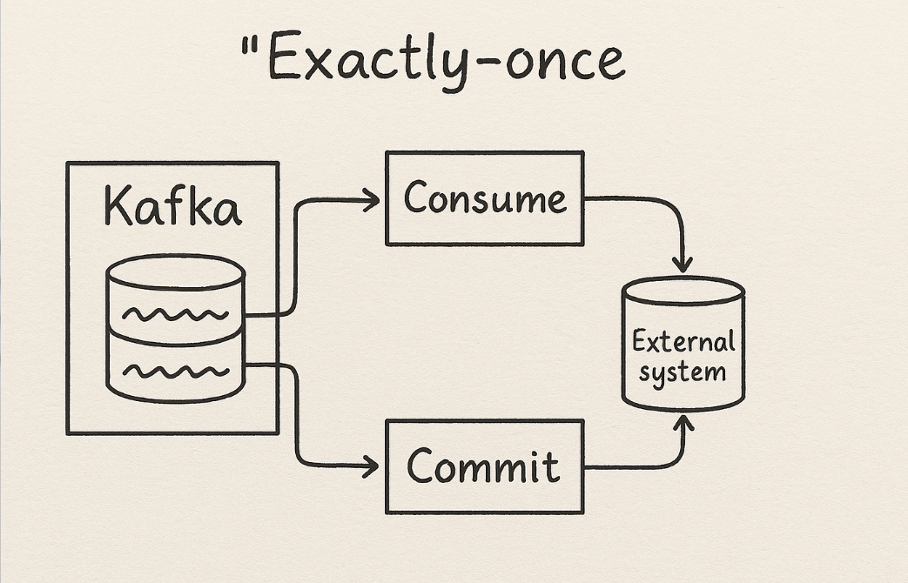

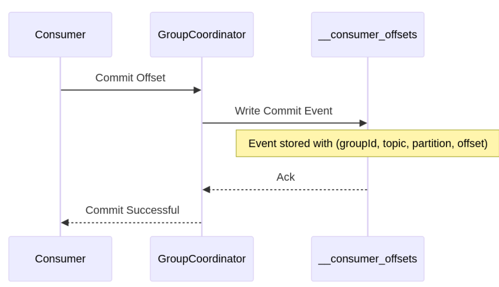

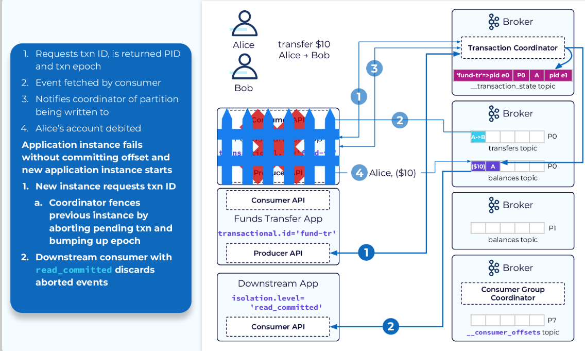

**Distributed Log Systems and Global Event Hubs**

Modern event-driven architectures rely on distributed log systems (e.g., Apache Kafka, Apache Pulsar, Azure Event Hubs, Amazon MSK) as the backbone for global event hubs. These systems provide durable, ordered, partitioned event streams that support high throughput, replication, and consumer scalability.

**Architecture Components**

**Producers** — Applications that publish events to topics, often with keys for ordering guarantees.
Partitioned event logs — Topics are divided into multiple partitions for parallelism and scalability. Each partition is an ordered, immutable sequence of records (append-only log).

**Replication clusters** — Partitions are replicated across multiple brokers (nodes) for fault tolerance. One broker acts as the leader for reads/writes; followers (in-sync replicas, ISRs) mirror the log.

**Consumer groups** — Consumers subscribe in groups for load balancing. Each partition is assigned to exactly one consumer in the group, enabling parallel processing.

**State stores** — Consumers maintain local state (e.g., databases, caches, or in-memory stores like RocksDB in Kafka Streams) updated from events, often with snapshots for fast recovery.


Partitioning strategy ensures related events (e.g., all events for a user or order) land in the same partition to preserve order. Producers route events using a deterministic function, typically:

partition = hash(key) \mod N

where key is a business identifier (e.g., user_id, order_id), hash is a consistent hashing function, and N is the number of partitions. This enables ordered processing within a partition while allowing massive parallelism across partitions.

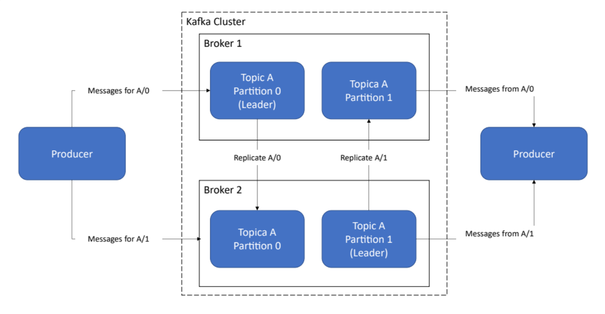

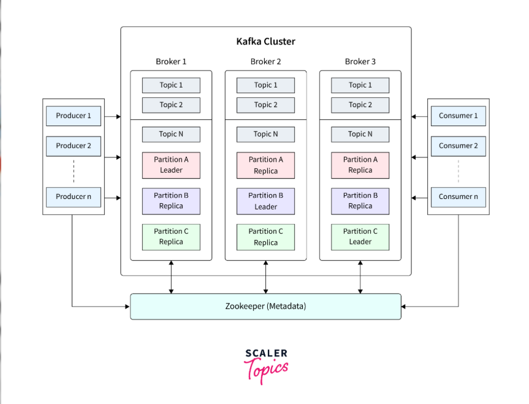

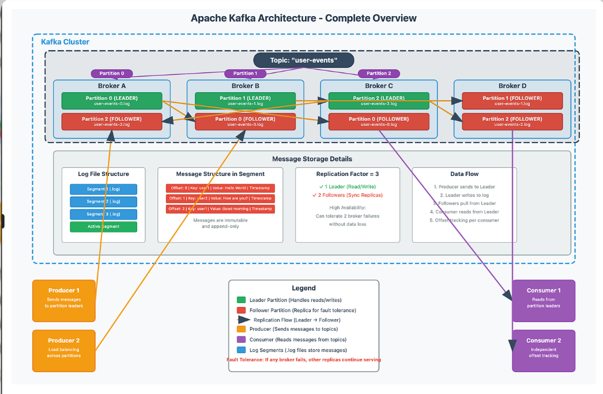

This partitioned, replicated log architecture underpins global event hubs, providing durability and scalability—but it also amplifies the exactly-once challenge: duplicates can arise from retries at any layer, consumer rebalances, or broker leader elections. Reliable exactly-once processing therefore builds on top of these foundations using idempotency, transactional APIs, and deterministic replay.

**Event Ordering and Global Consistency**

In distributed event-driven systems, especially those spanning global event hubs, the order in which events are processed profoundly impacts correctness. Business invariants—such as “payment must precede shipment” or “inventory deduction must reflect the latest reservation”—often depend on causal or sequential relationships between events. When ordering is violated, applications risk producing inconsistent state, duplicate side effects, or incorrect decisions.

**Ordering Models**

Distributed systems offer different ordering guarantees, each with distinct performance, scalability, and correctness trade-offs:

**Global ordering**

All events across the entire system share a single, totally ordered sequence, regardless of source or topic.

Characteristics: Achieved via a centralized sequencer, timestamp oracle (e.g., TrueTime in Spanner), or global log with strict serializability.

Cost: Extremely expensive at scale—single points of contention, high latency for cross-region coordination, and severe throughput limitations.

Use cases: Rare; reserved for systems requiring strict serializability across all data (e.g., certain financial ledgers or global unique constraint enforcement).

Most modern streaming platforms deliberately avoid this model to preserve horizontal scalability.

**Partition ordering**

Events are strictly ordered only within each partition of a topic or stream.
Characteristics: The dominant model in Apache Kafka, Pulsar, Azure Event Hubs, and similar systems. Producers assign events to partitions (typically via hash(key) mod N), and consumers process partitions independently and in order.

Advantages: Enables massive parallelism—thousands of partitions can be processed concurrently without coordination overhead.

Limitations: No ordering guarantee across partitions. Events for the same entity (e.g., order #123) must use the same key to land in the same partition; otherwise, related events may arrive out of order at consumers.

Implication: Application logic must either tolerate out-of-order arrival (via idempotency and buffering) or enforce partition affinity for causally related events.

**Causal ordering**

Events are ordered according to their causal dependencies rather than wall-clock time or a global sequence.

Characteristics: Preserves “happens-before” relationships: if event A causally precedes event B (e.g., A triggers B), then B is never processed before A, even across partitions or regions.

Use cases: Critical for workflows involving sagas, multi-step transactions, or distributed tracing where preserving intent matters more than absolute time.

Implementation: Requires metadata (e.g., vector clocks, Lamport timestamps, or hybrid logical clocks) to track and enforce causality.

Advanced: Vector Clocks for Causal Ordering

Vector clocks provide a lightweight, decentralized mechanism to capture causality in distributed systems without relying on synchronized physical clocks.

A vector clock for a system with n nodes (or processes) is a vector of counters:
VC = [v₁, v₂, …, vₙ]

Each vᵢ represents the number of events that process i has observed (including its own).

When process i generates a new event, it increments its own counter: VC[i] += 1.

When process i receives an event with vector clock VC', it merges by taking the component-wise maximum: VC[i] = max(VC[i], VC'[i]) for all i, then increments its own counter for the new event.

**Causality is determined by comparing vector clocks:**

Event A happened-before event B (A → B) if VC_A[k] ≤ VC_B[k] for all k, and VC_A[j] < VC_B[j] for at least one j.

Events are concurrent if neither A → B nor B → A holds (i.e., each clock has a higher value in at least one position).

In practice, vector clocks are embedded in event metadata or propagated via headers in messaging systems. Consumers can buffer events and reorder them (or delay processing) until all causally preceding events have arrived, ensuring correct execution order.

While vector clocks grow linearly with the number of nodes (or logical processes), optimizations such as version vectors with pruning, dotted version vectors, or hybrid logical clocks (HLCs) reduce overhead and integrate wall-clock time for practical use in global event hubs.
Implications for Global Event Processing.

Most production systems rely on partition ordering for performance, accepting that global or causal ordering must be enforced at the application layer when required. Techniques such as:

Deterministic processing with correlation IDs and dependency tracking.

Buffering and reordering in stateful stream processors (e.g., Kafka Streams, Flink).

Idempotent handlers that tolerate out-of-order arrival.

Saga patterns or compensating transactions for cross-partition coordination.

enable reliable outcomes even without strict global ordering. When strict causal consistency is mandatory, vector clocks or similar mechanisms become essential building blocks—balancing correctness against the scalability demands of globally distributed event-driven architectures.

**Lamport Timestamps Overview**

Lamport timestamps, introduced by Leslie Lamport in his seminal 1978 paper "Time, Clocks, and the Ordering of Events in a Distributed System", provide a simple yet powerful mechanism for establishing a partial ordering of events in distributed systems where physical clocks are unsynchronized or unreliable. Rather than measuring real (wall-clock) time, they capture logical time based on causality—the "happens-before" relation—ensuring that if one event causally influences another, the logical timestamp reflects that precedence.

**The Happens-Before Relation**

Lamport defined the happens-before relation (denoted →) as follows:

If two events a and b occur in the same process, and a precedes b, then a → b.

If a is the sending of a message and b is its receipt, then a → b.

The relation is transitive: if a → b and b → c, then a → c.

Events that are not related by happens-before are concurrent—neither causally precedes the other.

**How Lamport Timestamps Work**

Each process maintains a single integer counter (its logical clock), initialized to 0.

**The algorithm follows three simple rules**:

For any two events in the same process: If event a happens before event b, then the timestamp of b is strictly greater than the timestamp of a.

→ Each local event (send, internal action, receive) increments the local counter by 1 (or a fixed d, usually 1).

When sending a message: The sender attaches its current logical timestamp to the message.

When receiving a message: The receiver updates its local clock to the maximum of:

Its current local timestamp, and

The timestamp attached to the incoming message

Then increments its local counter by 1.


**Formally**:

For a local event: C_i := C_i + 1

For sending message m: T_m := C_i (attach current clock), then C_i := C_i + 

For receiving message m with timestamp T_m: C_i := max(C_i, T_m) + 1

**This ensures the key correctness property**:

If a → b, then C(a) < C(b)

(where C(e) is the Lamport timestamp assigned to event e).

***Properties and Guarantees***

Partial ordering consistent with causality — All causally related events are correctly ordered.

Total ordering possible — By combining the timestamp with a unique process ID (or tie-breaker), systems can impose an arbitrary total order on all events (useful for conflict resolution, e.g., in distributed databases using last-writer-wins).

Minimal overhead — Only a single integer per process and per message.

No detection of concurrency — If two events have the same timestamp (or incomparable via the rules), Lamport timestamps cannot distinguish true concurrency from potential causality hidden by the scalar value.

**Comparison to Vector Clocks**

While Lamport timestamps are simple and compact, they provide only a partial (causal) ordering and cannot detect concurrency reliably.

Vector clocks extend the idea by maintaining a vector VC = [v₁, v₂, …, vₙ] (one counter per process). This allows precise detection of:

A → B if VC_A ≤ VC_B component-wise and VC_A < VC_B in at least one position.
Concurrency if neither A → B nor B → A holds.

Vector clocks are more expressive but incur higher storage and bandwidth overhead proportional to the number of processes.

**Use Cases in Distributed Systems**

Ordering log entries or audit trails in microservices.

Conflict resolution in eventually consistent databases (e.g., last-writer-wins with tie-breaking).

Debugging causality in distributed tracing.

Basis for more advanced protocols (e.g., version vectors, hybrid logical clocks).

Lamport timestamps remain foundational because of their elegance and efficiency—offering strong causal guarantees with almost no cost—making them a go-to primitive when full concurrency detection (via vector clocks) is unnecessary. In globally distributed event-driven systems, they complement partition ordering by helping enforce causal dependencies across partitions or services when strict global ordering would be too expensive.

**Exactly-Once Processing Mechanisms**

This section details the core engineering techniques that enable exactly-once processing in distributed event-driven microservices, particularly across global event hubs like Apache Kafka. These mechanisms—idempotent producers, transactional messaging, consumer state tracking, and atomic commit protocols—work in concert to eliminate duplicates and prevent loss, even amid network partitions, crashes, and retries. When composed properly, they realize the thesis: exactly-once semantics demand idempotent processing, transactional messaging, and deterministic state management.

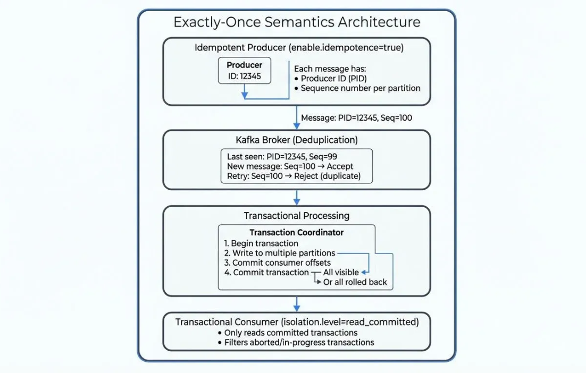

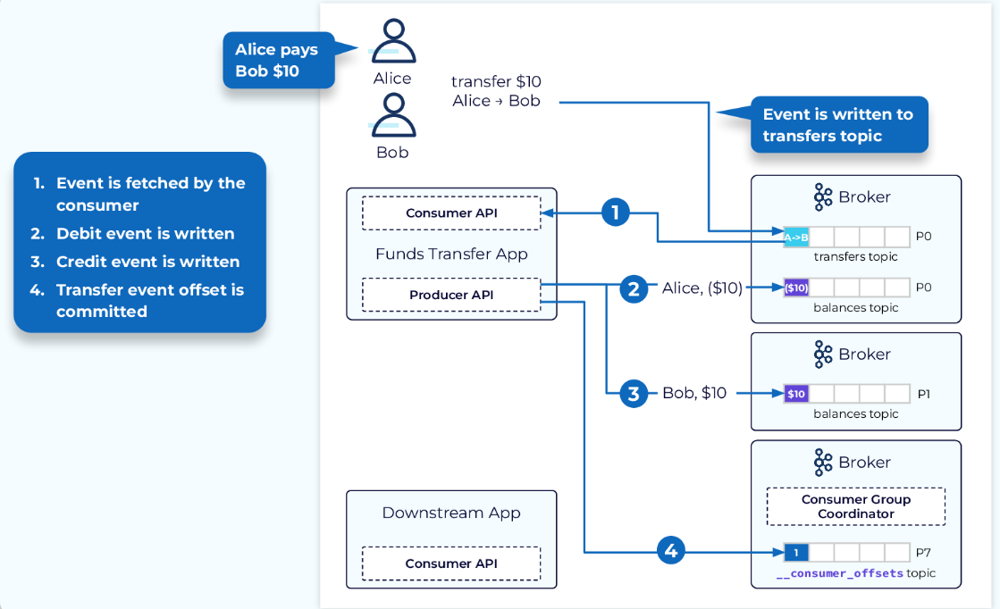

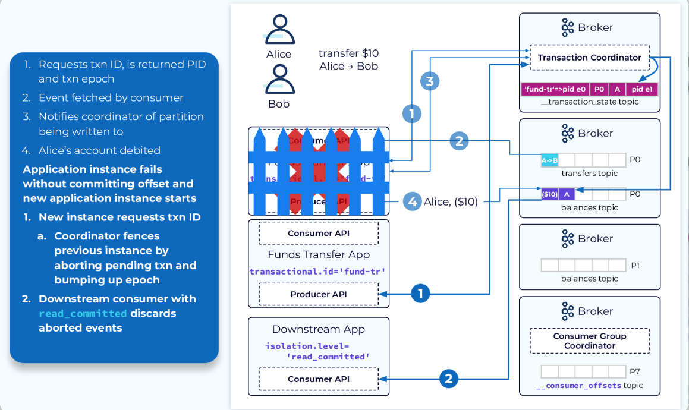

1. **Idempotent Producers**
   
Modern producers (e.g., Kafka producers with enable.idempotence=true) assign a unique Producer ID (PID) and a monotonically increasing sequence number per partition. The broker deduplicates by tracking the last seen sequence per PID-partition pair, rejecting retries with stale or duplicate sequences.

This eliminates producer-side duplicates from network-induced retries without application changes.
Key benefit: At-least-once delivery becomes effectively exactly-once from the broker's perspective for a single producer instance.

2. **Transactional Messaging**
   
Kafka's transactional producer API allows atomic writes across multiple partitions and topics within a transaction. The producer initiates a transaction, sends messages (potentially to output topics), and commits or aborts. A separate transaction coordinator tracks state in an internal topic (__transaction_state).

Consumers configured with isolation.level=read_committed only see committed data, filtering out in-flight or aborted transactions.

This enables atomic "consume-process-produce" cycles: read an input event, process it, produce output events, and commit offsets—all or nothing.

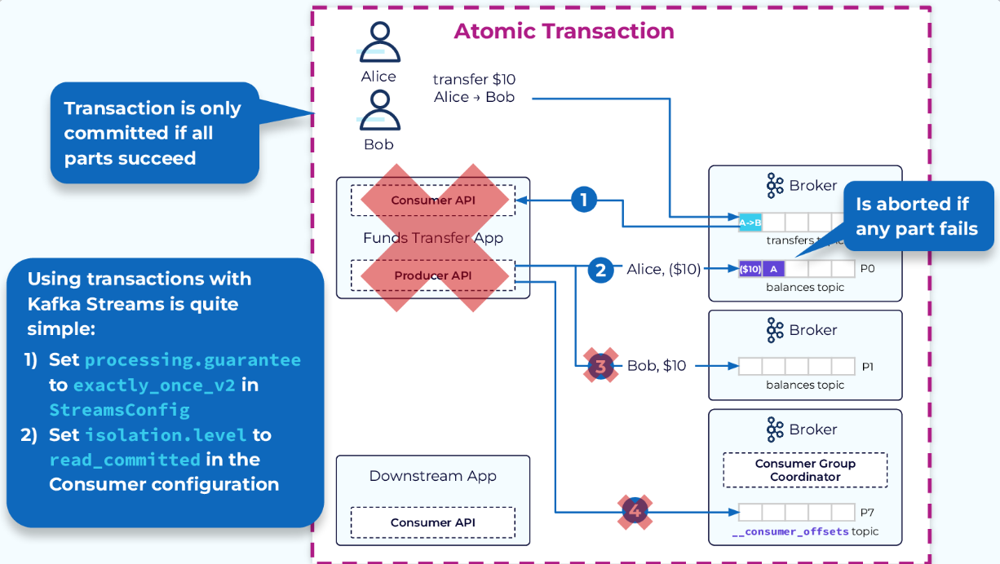

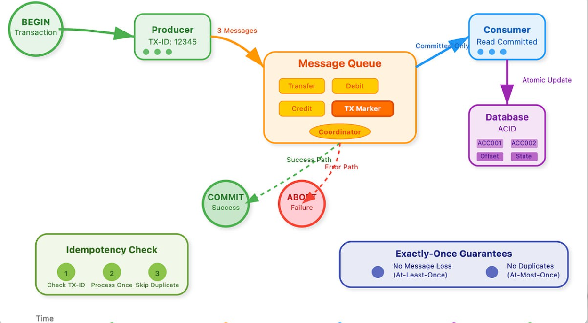

3. **Consumer State Tracking**
   
Consumers must handle at-least-once delivery by making processing idempotent. A common pattern tracks processed event identifiers (e.g., unique message IDs, idempotency keys, or correlation IDs) to skip duplicates.

**This can us**e:

In-memory sets (for short-lived consumers)

Persistent deduplication tables (e.g., in a database or RocksDB)

Bloom filters or probabilistic structures for scale

**Idempotent processing explained**

Idempotency means repeated application of the same event produces the same outcome as a single application—no additional side effects.

For side-effect-free operations (e.g., setting a value), this is trivial. For mutating operations (e.g., incrementing counters, sending emails), idempotency requires:

Unique event identifiers.

Checking if already processed.

Skipping or safely retrying business logic

Example concept code (simplified Python pseudocode for illustration):

```python
processed_ids = set()  # In production: use persistent store like Redis/DB

def process_event(event):
    event_id = event['id']  # Unique idempotency key (UUID, hash, or message ID)
    
    if event_id in processed_ids:
        logger.info(f"Skipping duplicate event {event_id}")
        return  # Or return cached result if needed
    
    try:
        execute_business_logic(event)  # e.g., update DB, call external API
        processed_ids.add(event_id)
        # In real systems: persist to DB transactionally with state update
    except Exception as e:
        # Handle failure; do NOT add to processed_ids on error
        raise
```

In production, pair this with transactional commits (next point) to avoid adding to the set before side effects succeed.

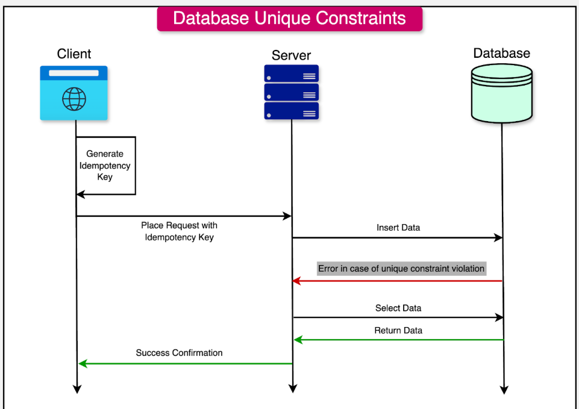

4. **Atomic Commit Protocols**
   
To prevent partial commits (e.g., business state updated but offset not committed), use two-phase or transactional outbox patterns:

Outbox pattern — Write business events and state changes to an outbox table in the same database transaction as the side effects. A separate poller/producer reads committed outbox entries and publishes them reliably.

Kafka Streams / Flink exactly-once — Built-in checkpointing + transactional producers/consumers commit offsets and state atomically during checkpoints.

2PC alternatives — Avoid true distributed 2PC; instead, use Kafka transactions for broker-internal atomicity and application-level compensation for external systems.

These mechanisms collectively ensure P(e_i) = 1 across failures: producers deduplicate sends, transactions provide atomic multi-partition writes, consumers skip duplicates via tracking, and atomic commits bind processing to offset advances. In globally distributed setups, careful keying (partition affinity) and read-committed isolation further preserve consistency without global coordination overhead.

**Distributed Transactions and Two-Phase Commit**

Exactly-once processing in distributed event-driven systems frequently necessitates mechanisms that mimic distributed transaction semantics, ensuring atomicity across decoupled components (e.g., consume an event, update state, produce outputs, commit offsets). While true distributed transactions are rare due to availability costs, the Two-Phase Commit (2PC) protocol remains a foundational approach for coordinating commits in systems like Kafka transactions or Flink sinks.
Two-Phase Commit Protocol
2PC involves a coordinator (e.g., transaction manager) and multiple participants (e.g., resource managers like databases or brokers).

Phase 1: **Prepare (Voting Phase)**

The coordinator sends a "prepare" (or "canCommit?") message to all participants.
Each participant checks if it can commit the transaction (e.g., acquire locks, validate constraints, persist changes tentatively).

Participants respond with "vote-commit" (yes, ready to commit) or "vote-abort" (no).
If any participant votes abort, or if timeouts occur, the coordinator decides to abort globally.

Phase 2: **Commit (Decision Phase**)

If all votes are commit, the coordinator sends "global-commit" to all participants.
Participants apply changes durably (e.g., release tentative state, make updates visible) and acknowledge.

If any abort vote or coordinator decision is abort, it sends "global-abort"; participants rollback tentative changes.

Once all acknowledgments arrive, the transaction is complete.

**Problems with 2PC**

Despite ensuring atomicity, 2PC introduces significant drawbacks, especially in large-scale, globally distributed environments:

**Blocking**

Participants enter a "prepared" state after voting commit and must wait indefinitely for the coordinator's decision. If the coordinator fails (crash, network partition, long GC pause), participants remain blocked—holding locks, resources, or tentative state—preventing progress on other transactions and reducing availability. This is the most severe limitation: no unilateral decision is safe without risking inconsistency.

**Coordinator Failure**

The coordinator is a single point of failure. If it crashes after collecting prepare votes but before broadcasting the decision, participants cannot resolve the transaction autonomously. They must wait for coordinator recovery (or manual intervention), leading to prolonged blocking. Even with logging and recovery protocols, certain failure combinations (e.g., coordinator + participant failure during commit phase) can leave the system unable to determine the outcome without heuristics or human resolution.

**Performance Overhead**

Synchronous voting and decision phases introduce latency (multiple round-trips), reduce throughput under high contention, and amplify failure impact in geo-distributed setups with variable network latency.

**Limited Fault Tolerance**

2PC assumes reliable failure detection and does not handle multiple simultaneous failures gracefully. It prioritizes consistency over availability (CP in CAP terms), making it unsuitable for highly available systems.

**Three-Phase Commit (3PC)**

3PC extends 2PC to reduce blocking and improve fault tolerance by introducing an intermediate phase, making the protocol non-blocking under certain failure scenarios (though still complex and rarely used in production due to added overhead).

**Phases in 3PC**

Phase 1: CanCommit (same as 2PC Prepare) — Participants vote yes/no.

Phase 2: PreCommit (new)

If all vote yes, coordinator sends "preCommit" (prepare-to-commit).

Participants acknowledge and enter a "pre-committed" state with a timeout.

This phase broadcasts the tentative decision early.

Phase 3: DoCommit (similar to 2PC Commit)

Coordinator sends "doCommit" or "doAbort" after receiving preCommit acks.

Participants apply/abort and acknowledge.

**Improvements over 2PC**

**Reduced Blocking**

In preCommit phase, participants know a commit is likely and can timeout independently if the coordinator fails—transitioning to commit after timeout (assuming coordinator would have committed if alive). This avoids indefinite blocking in coordinator-failure cases (non-blocking for coordinator crash after preCommit).

**Better Failure Recovery**

With timeouts and the extra phase, participants can make progress without waiting forever. In coordinator failure during preCommit, surviving participants can elect a new coordinator or timeout to commit, preserving liveness in more scenarios.

**Trade-offs**

3PC adds latency (extra round-trip), message overhead, and complexity. It is still vulnerable to certain multi-failure cases (e.g., network partitions splitting participants) and rarely implemented in production systems, which prefer alternatives like Paxos/Raft for consensus or application-level compensation (sagas) for transactions.

In practice, modern systems avoid pure 2PC/3PC for global coordination, favoring idempotency, transactional messaging (e.g., Kafka transactions), and eventual consistency to balance correctness and availability.

**Stream Processing Frameworks**

Stream processing frameworks like Apache Kafka Streams, Apache Flink, and Apache Spark Streaming provide native support for exactly-once processing, enabling stateful computations over unbounded event streams with fault tolerance.

**Stream Processing Pipelines**

Pipelines ingest events from sources (e.g., Kafka topics), apply transformations (map, filter, join, aggregate), and sink results to stores or topics. Frameworks handle parallelism via partitioning.

**Windowed Computation**

Aggregate over time windows (tumbling, sliding, session) using event time (ingestion timestamp) or processing time. Watermarks handle late events.

**Event-Time Processing**

Assign timestamps to events; watermarks track progress. Late events trigger side outputs or updates.
Stateful Stream Operators

Maintain state (e.g., counters, keyed aggregations, joins). Frameworks manage state distribution and scaling.

**Checkpointing and State Snapshots**

Core to exactly-once: periodic consistent snapshots of operator state + input positions (e.g., Kafka offsets).

In Flink: Checkpoint barriers injected into streams align across operators. Barriers trigger state snapshots (RocksDB, Heap). Snapshots stored durably (S3/HDFS). On failure, restore latest checkpoint + resume from aligned offsets.

In Kafka Streams: Changelog topics back state stores; exactly-once via transactional producers/consumers + standby tasks.

**Recovery from Failures**

On restart/rebalance, restore state from snapshot/checkpoint, rewind input to checkpointed position, replay events deterministically. Ensures no loss/duplicates.

A typical stream processing pipeline with checkpoints includes sources emitting data + barriers, operators processing and snapshotting state on barriers, and sinks committing transactionally.

1.  **Global Event Processing Across Regions**
2. 
Planet-scale systems (e.g., Uber, Netflix, financial platforms) replicate events across regions for low-latency access, disaster recovery, and regulatory compliance.

**Challenges**

Network latency — Cross-region writes/reads add 50–200 ms RTT.

Replication delays — Asynchronous replication causes lag (seconds to minutes).

Cross-region consistency — Ordering violations, stale reads, or conflicts.

Geo-replication — Handling partitions, failovers, and conflict resolution.

**Replication Models**

**Active-Active Replication**

All regions accept writes independently; changes replicated bidirectionally (e.g., CRDTs, last-writer-wins, or custom merging). High availability, low latency, but eventual consistency with conflict risks.

**Active-Passive Replication**

Primary region handles writes; secondary regions replicate read-only or standby for failover. Simpler consistency (stronger in primary), but higher failover time and underutilized resources.

**Consistency Trade-offs and CAP Theorem**

CAP theorem states a distributed system can provide at most two of: Consistency (all nodes see same data), Availability (every request gets response), Partition Tolerance (system works despite network partitions).

Event-driven global systems are partition-tolerant by design (networks fail). They trade:

CP → Strong consistency, sacrifice availability (e.g., global locking, synchronous replication).
AP → High availability, eventual consistency (common: accept replication lag, use idempotency/compensation).

CA → Rare (single-region).

Most choose AP for scale, using idempotency and deterministic processing to reconcile inconsistencies.

**State Management in Event-Driven Systems**

Reliable state management forms the bedrock of exactly-once semantics in event-driven microservices. The core requirement is that application state—whether aggregate counts, user sessions, inventory levels, or materialized views—must survive crashes, restarts, scaling events, and failures without introducing duplication (extra increments) or loss (missed updates). This demands deterministic, recoverable, and fault-tolerant state handling that aligns with the at-least-once nature of most messaging systems while enforcing exactly-once effective semantics at the application level.

**Distributed State Stores**

State is typically maintained in distributed, sharded, and replicated key-value or column-family stores optimized for stream processing workloads:

RocksDB — The default embedded backend in Apache Flink and Kafka Streams. It provides fast, on-disk key-value storage with compaction, incremental snapshots, and low-latency point lookups. RocksDB is embedded in the processing node, reducing network hops but requiring careful management of disk I/O and memory during scaling or failover.

Cassandra or ScyllaDB — Used for external, highly available state in large-scale deployments (e.g., Netflix's event pipelines). They offer tunable consistency, multi-region replication, and high write throughput, but introduce network latency and require careful partitioning to avoid hotspots.

DynamoDB or Amazon Keyspaces — Serverless options for managed durability and global tables. Ideal for variable workloads but can incur higher costs and eventual consistency trade-offs unless strongly consistent reads are used sparingly.

Other alternatives — Redis (for hot caches), PostgreSQL with partitioning, or custom stores like TiKV for stronger consistency needs.

These stores are sharded by key (often aligned with Kafka partition keys) and replicated for fault tolerance, ensuring state availability during node failures.

**Checkpointing**

Checkpointing creates periodic, consistent global snapshots of distributed operator state and input positions (e.g., Kafka offsets) without pausing processing.

**In frameworks like Flink**:

Checkpoint barriers flow through the topology like special events.

When a barrier reaches an operator, it snapshots its local state (e.g., RocksDB incremental checkpoint) and acknowledges upstream.

Barriers align across parallel instances to ensure consistency (aligned checkpoints) or use unaligned mode for lower latency under backpressure.

Snapshots are written to durable storage (S3, HDFS, GCS) with metadata tracking.

Kafka Streams uses changelog topics (compacted) to back state stores, with standby replicas and interactive query support.

Checkpoints are lightweight (incremental diffs) and frequent (seconds to minutes), balancing recovery time and overhead.

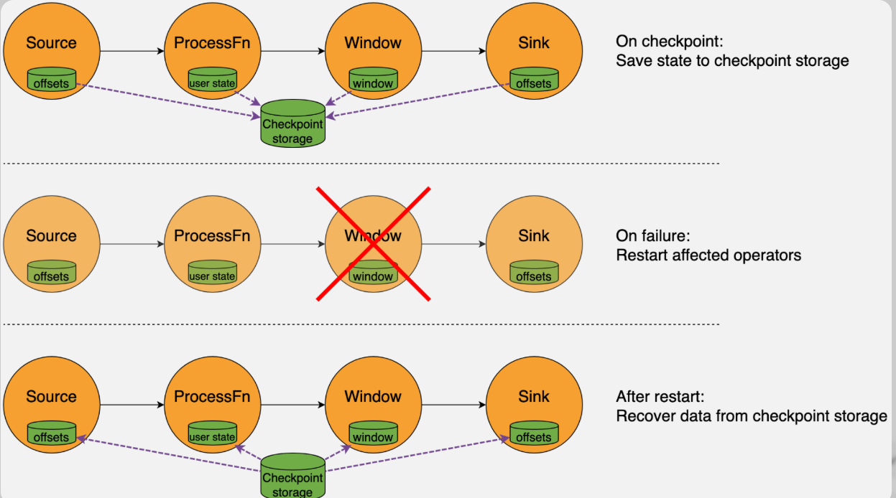

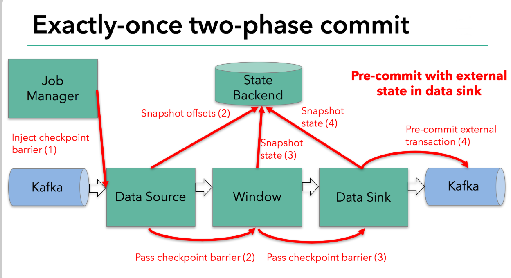

**Snapshot Recovery**

**Recovery replays from the last successful checkpoint**:

Restore state from the snapshot (load RocksDB files or deserialize).

Rewind input streams to the checkpointed offsets.

Replay events deterministically from that point onward.

Resume processing once caught up.

This guarantees no lost or duplicated state updates, as replay is exact and idempotent handlers tolerate any transient duplicates during catch-up.

**Log Compaction**

Kafka's log compaction transforms topics into key-value tables by retaining only the latest value per key, discarding older duplicates. Configured via cleanup.policy=compact and min.compaction.lag.ms.

Compaction runs in the background: the log cleaner reads segments, keeps the highest-offset record per key (based on offsets or timestamps), and rewrites compacted segments.

This reduces storage for state topics (e.g., KTables in Kafka Streams) from unbounded growth to roughly the size of unique keys, enabling long-lived materialized views without indefinite log bloat.

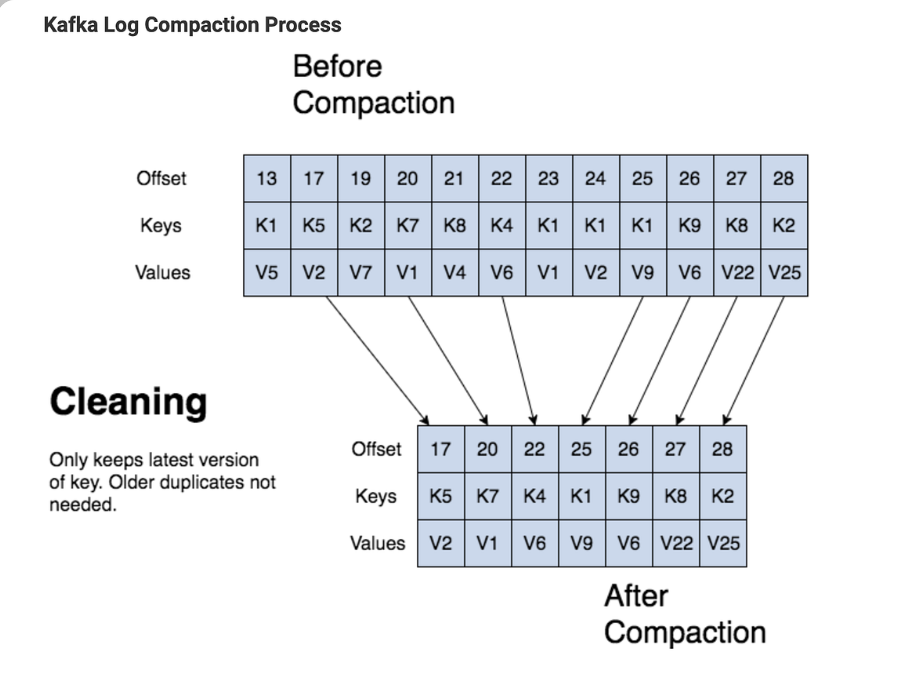

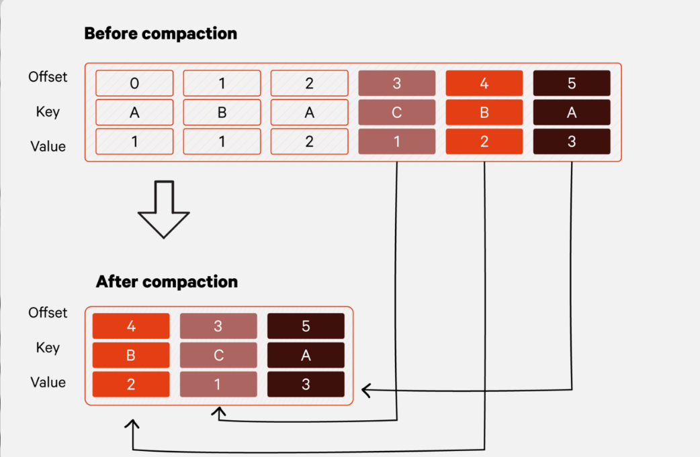

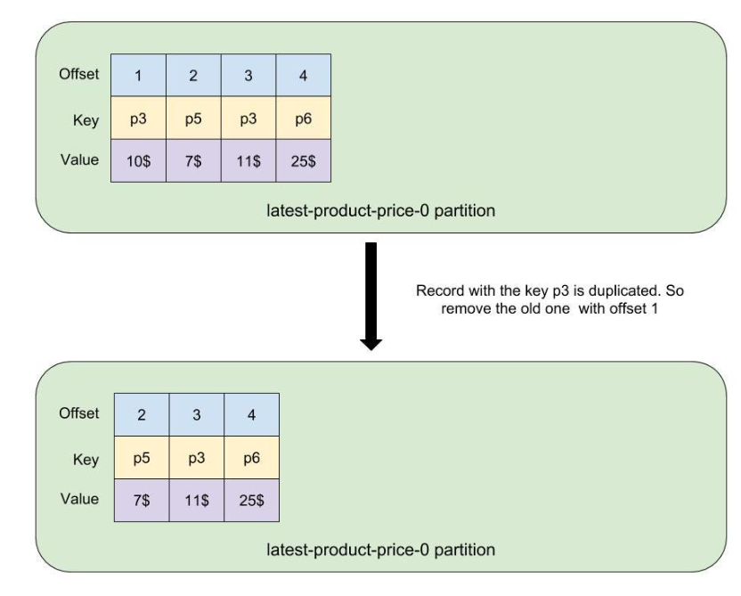

**State Machine Replication**

State machine replication (SMR) ensures multiple replicas maintain identical state by applying the same sequence of deterministic events or commands in the same order.

Determinism guarantees that replaying the exact sequence from any starting state yields the identical end state. This is foundational to:

Event sourcing — Rebuild aggregate state by replaying persisted events.

Consensus protocols — Raft/Paxos replicate a log of commands; followers apply them to their state machines after leader commitment.

Fault tolerance — A failed replica recovers by catching up the log from peers.

SMR enables high availability (quorum-based reads/writes) and strong consistency without single points of failure.

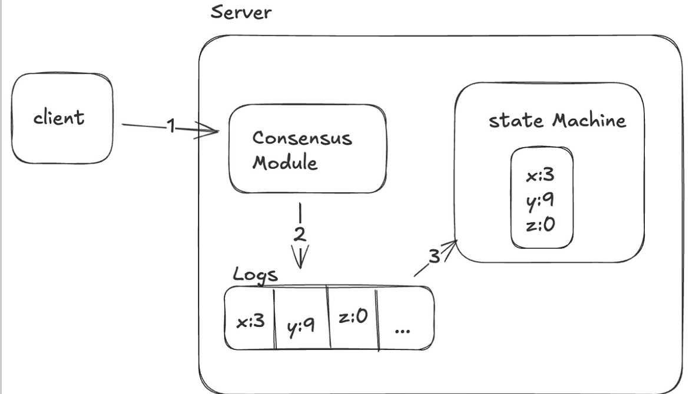

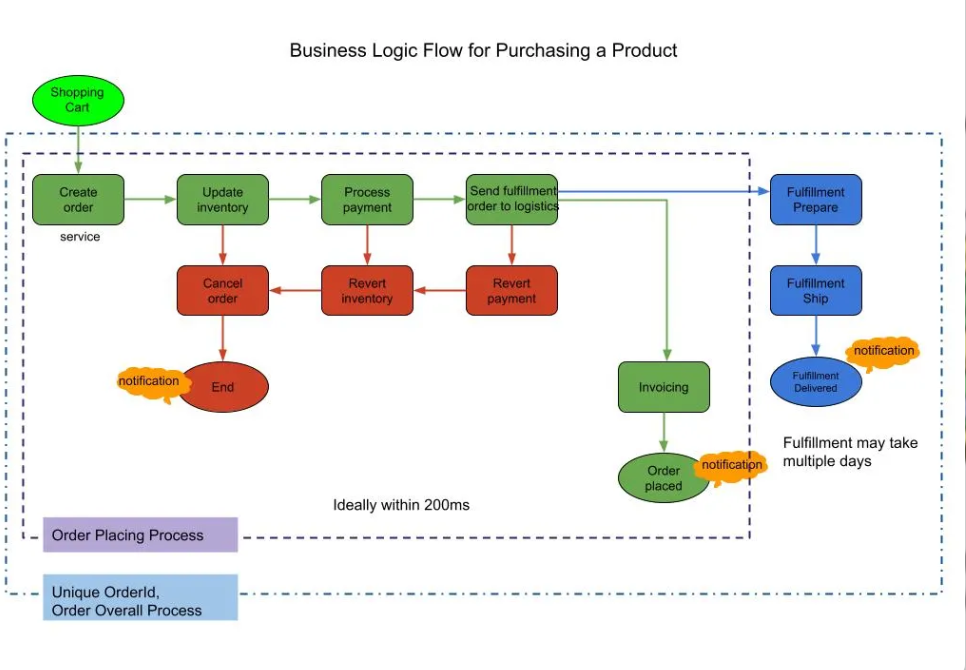

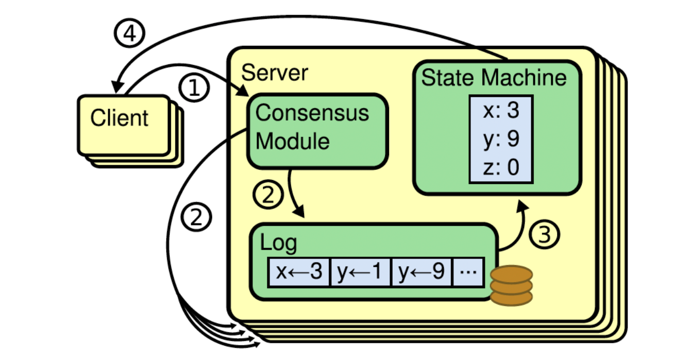

**Observability for Event Processing Pipelines**

In complex, distributed pipelines, observability turns opaque black boxes into debuggable, diagnosable systems. It answers: Is the pipeline healthy? Where are latencies spiking? Are we losing events? Why is state inconsistent?

**Key Metrics and Monitoring**

Event Latency Metrics — Measure end-to-end time from production to consumption/processing completion. Track histograms (p50, p95, p99) for processing duration, watermark delays (in event-time systems), and propagation latency across services.

Consumer Lag Monitoring — Kafka lag = latest offset - committed consumer offset per partition/group. High lag signals backpressure, under-provisioning, or slow processing. Alert on sustained growth or per-partition outliers.

Event Throughput Analysis — In/out messages per second, bytes per second, partition imbalance (hot partitions), backpressure signals (blocked operators in Flink), and error rates (dead-letter queues, failed retries).

Distributed Tracing — Propagate context (trace ID, span ID, baggage) via headers. Track event journeys across producers, brokers, consumers, and external calls. Identify bottlenecks (slow sinks), failures (retries in sagas), or ordering violations.

**Essential Tools**

Prometheus + Grafana — Pull-based metrics scraping, powerful querying (PromQL), and rich dashboards for lag, throughput, latency, and resource usage (CPU/memory/disk per broker/consumer).

Jaeger (or Zipkin) — End-to-end distributed tracing with OpenTelemetry instrumentation. Visualize traces, spans, dependencies, and error propagation.

ELK Stack / Loki + Grafana — Centralized logging (structured JSON logs) correlated with traces/metrics. Loki for efficient log storage/querying.

**Observability Pipeline**
Events and telemetry flow through instrumentation → collectors/exporters → backends → visualization/alerting. OpenTelemetry standardizes collection (metrics, traces, logs) for vendor neutrality.

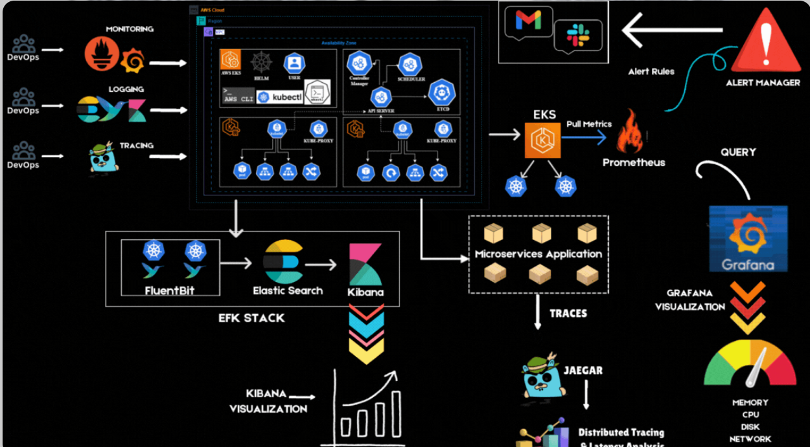

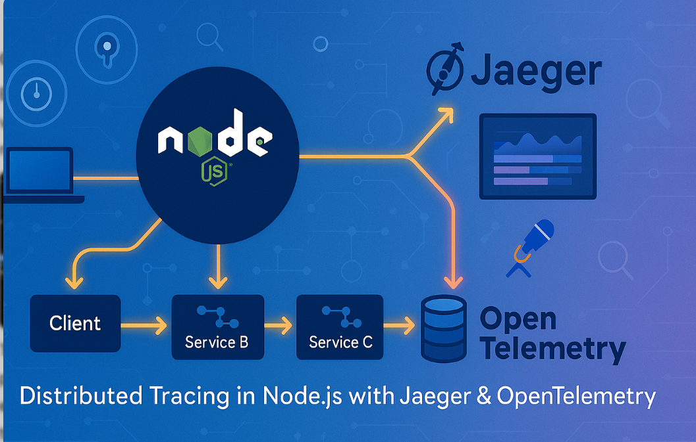

These capabilities—combined with alerting on SLOs (e.g., lag < 1 min, p99 latency < 500ms)—enable proactive issue detection, root-cause analysis, and continuous improvement in globally distributed event-driven architectures. Exactly-once semantics, while engineered through idempotency, transactions, and determinism, are only trustworthy when backed by deep observability.

**Failure Recovery Mechanisms**

Distributed event-driven systems, by design, operate in environments prone to partial failures—node crashes, network partitions, broker outages, or consumer restarts. Robust recovery ensures that processing resumes with exactly-once (or effectively exactly-once) semantics: no lost events, no unintended duplicates, and consistent final state. The key mechanisms—checkpoint restoration, log replay, state reconstruction, and offset recovery—work together to achieve this resilience without requiring manual intervention or data loss.

**Core Mechanisms**

Checkpoint Restoration

Checkpoints are periodic, globally consistent snapshots of distributed processing state (operator state + input positions/offsets) captured without halting the pipeline. Frameworks like Apache Flink use aligned or unaligned checkpoint barriers injected into the data stream; when barriers propagate through all operators, each snapshots its local state (e.g., RocksDB incremental diff) and reports completion. Snapshots are stored durably (S3, GCS, HDFS) with metadata linking them to offsets.

Restoration loads the latest successful checkpoint, overwriting in-memory/on-disk state.

**Log Replay**

After restoring a checkpoint, the system rewinds input streams (e.g., Kafka topics) to the exact offsets recorded in the checkpoint. It then replays subsequent events deterministically. 

Replay is bounded: only events after the checkpoint need processing, minimizing catch-up time.

**State Reconstruction**

In event-sourced systems, state is rebuilt by replaying the entire (or compacted) event log from the beginning or from a snapshot + delta events. Snapshots serve as fast-forward checkpoints; subsequent events apply via the deterministic handler. This approach provides natural auditability and temporal querying but trades off replay time for storage efficiency when using log compaction.

**Offset Recovery**

Consumer offsets (committed positions in the log) are recovered from the broker's __consumer_offsets topic (Kafka) or equivalent. On restart, the consumer group coordinator reassigns partitions and resumes from the last committed offset (or earliest/latest based on auto.offset.reset). For exactly-once, frameworks like Kafka Streams or Flink tie offset commits to state checkpoints transactionally, ensuring offsets advance only after state is durably updated.

**Example Recovery Workflow**

Consider a stateful stream processor (e.g., Flink job or Kafka Streams application) handling keyed aggregations:

Consider a stateful stream processor (e.g., Flink job or Kafka Streams application) handling keyed aggregations:

1. **Node Crash** — A task manager node fails mid-processing. In-flight events may be partially processed; uncommitted state is lost locally.
   
2. **Checkpoint Recovery** — The job manager detects failure, restarts the task on a healthy node, and instructs it to fetch the most recent successful checkpoint from durable storage. The task restores operator state (e.g., RocksDB files) and input offsets from the checkpoint metadata.

3. **Replay Events** — The task rewinds its Kafka consumer to the checkpointed offsets, replays events deterministically, and re-applies them to the restored state. Idempotent handlers or deduplication ensure no double-counting during catch-up.
   
4. **Rebuild State** — As replay progresses, state converges to the pre-failure point. Once caught up to the live tail, normal processing resumes. Downstream consumers see continuous, consistent output.

This workflow typically completes in seconds to minutes (depending on checkpoint interval and event volume), preserving throughput and correctness.

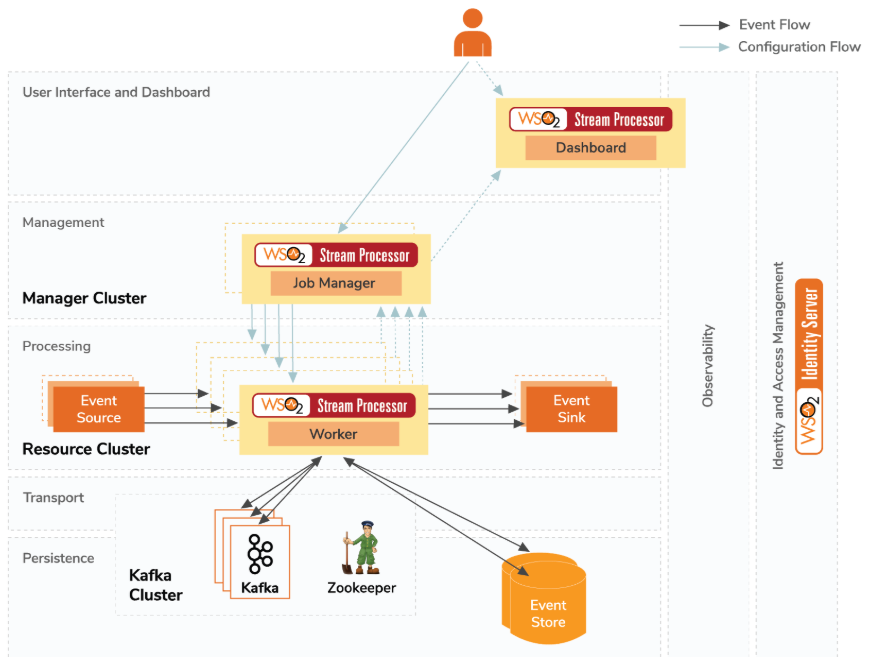

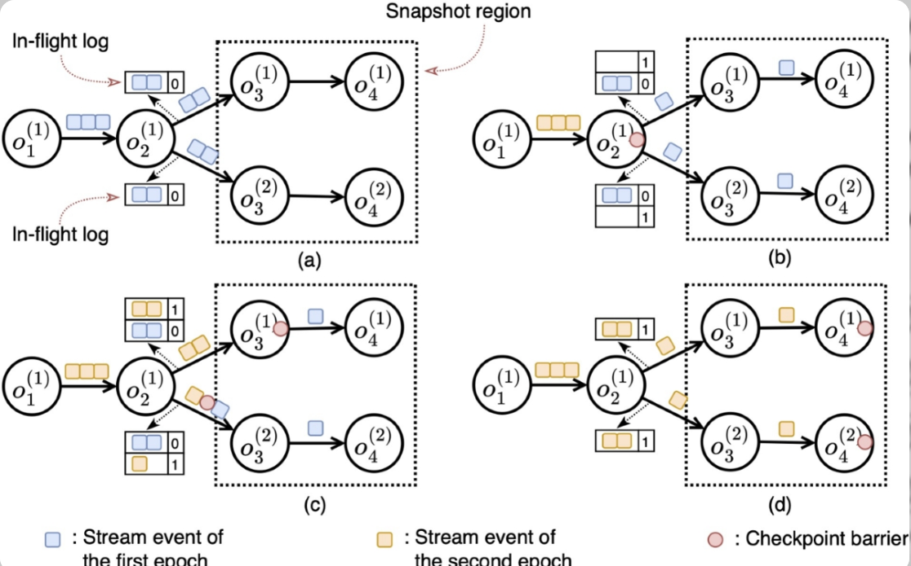

**Security and Data Integrity in Event Hubs**

Global event hubs handle sensitive data (financial transactions, personal telemetry, PII) across untrusted networks and multi-tenant infrastructures. Security ensures confidentiality, integrity, authenticity, and non-repudiation while maintaining high throughput.

**Event Authentication**

Producers authenticate via SASL (PLAIN, SCRAM, GSSAPI/Kerberos) or mutual TLS client certificates. Kafka supports ACLs (Access Control Lists) at topic/operation level (e.g., READ/WRITE on specific topics). Azure Event Hubs and Pulsar use similar token-based (OAuth/JWT) or certificate auth.

**Encryption in Transit**

All communication uses TLS 1.2/1.3 with strong ciphers. Brokers enforce TLS-only listeners; clients verify server certificates. End-to-end encryption can layer application-level encryption (e.g., envelope encryption with per-event keys) for stricter requirements.

**Event Signature Verification**

Producers sign events with HMAC or asymmetric keys (ECDSA, EdDSA). Consumers verify signatures before processing. This prevents tampering by intermediaries and provides non-repudiation. Frameworks like Kafka Connect or custom serializers integrate signing.


**Tamper-Proof Logs**

Append-only logs with cryptographic chaining make retroactive tampering detectable. Each event includes a hash linking to the previous event's hash, forming an immutable chain.

 **Cryptographic Hashing for Event Integrity**

To ensure immutability and detect tampering:

Each event e_i includes a payload, metadata, and a hash H(e_i) = hash(previous_hash || event_content || timestamp || nonce).

The hash function (SHA-256, SHA-3, BLAKE3) is collision-resistant and one-way.

The first event starts with a genesis hash (e.g., hash of a root secret).

On append, the broker or producer computes and stores the new hash; consumers verify the chain from a trusted anchor.


Any alteration to an earlier event breaks the chain for all subsequent events, making tampering evident. This pattern mirrors blockchain merkle trees but is optimized for high-throughput append-only logs (no consensus overhead).

In production, combine with log signing (periodic merkle root signed by trusted authority) and audit trails for forensic integrity.

These mechanisms—recovery resilience paired with strong security—ensure that globally distributed event-driven systems remain reliable, correct, and trustworthy even under adversarial conditions or catastrophic failures.

**Global Payment Processing System**

A high-value, planet-scale payment processing system must handle millions of transactions per second with strong correctness guarantees: no lost funds, no double-spending, no duplicate charges, full auditability, low latency for user experience, and resilience across geographic regions. The design leverages an event-driven microservices architecture with a global event hub as the central nervous system, ensuring decoupling, scalability, and exactly-once semantics.

**Architecture Overview**

The system adopts event sourcing + CQRS principles for the core transaction path, combined with transactional messaging and idempotent processing to achieve reliable, auditable financial state changes.

**Key Components**

Payment Services (Frontend / Ingress Layer)

Mobile apps, web checkout, POS terminals, API gateways.

Accept payment intents (card, wallet, bank transfer).

Perform initial validation (fraud signals, rate limiting, auth).

Produce immutable "PaymentInitiated" or "TransferRequested" events with unique transaction ID.

**Global Event Hub (Apache Kafka / Confluent Platform or equivalent)**

Multi-region, geo-replicated cluster with exactly-once guarantees.

Partitioned topics keyed by transaction ID, account ID, or merchant ID to preserve order within entities.

Topics include: payment-events, transaction-commands, balances, audit-log (compacted).

Idempotent producers + transactional APIs ensure atomic writes.

**Transaction Processors (Stream Processing Layer)**

Stateful stream processors (Kafka Streams, Apache Flink) or microservices consuming events.
Key responsibilities:

Validate business rules (sufficient funds, compliance checks).

Apply debits/credits atomically using event sourcing.

Produce downstream events ("DebitApplied", "CreditApplied", "TransferCompleted").

Use exactly-once semantics via transactional producers/consumers + idempotent handlers.

**Audit Ledger (Immutable Append-Only Store)**

Dedicated compacted Kafka topic or specialized ledger database (e.g., immutable event log + materialized views).

Stores every state-changing event with cryptographic signatures/hashes for tamper-proof audit trail.

Supports temporal queries, reconciliation, regulatory reporting (e.g., GDPR, PCI-DSS).

Projections build current balances, transaction history for queries.

**Additional supporting components (not core but implied)**:

Fraud Detection Service (real-time ML scoring on events).

Notification Service (email/SMS on completion/failure).

Reconciliation & Settlement Batch Jobs (periodic external bank sync).

**Processing Workflow**

1. **Payment Event Generated**

User initiates payment → Payment Service validates → Produces event  to global hub using idempotent producer.

1. **Event Written to Global Hub**
Kafka broker durably appends event (replicated across regions), assigns offset. Transactional producer ensures atomicity if part of multi-event flow.

1. **Processors Consume Event**
   
Transaction Processor (consumer group) fetches event.

Checks idempotency key / deduplication table.

Loads current state (from snapshot + replay or KTable).

Validates (funds, limits, fraud score).

Produces compensating events if invalid (e.g., PaymentRejected).

**If valid, atomically**:

Updates internal ledger state.

Produces DebitApplied and CreditApplied events.

Commits offset transactionally (Kafka exactly-once).


**Transaction Committed Exactly Once**

Downstream consumers (e.g., Notification, Settlement) process output events idempotently.

Audit ledger receives all events immutably.

Final materialized views update balances, transaction history.

User receives confirmation via callback or polling.

**Failure Modes Handled**

Duplicate events → Idempotency keys + deduplication.

Processor crash → Checkpoint restore + replay from last offset.

Network partition → Kafka replication + eventual consistency reconciliation.

Partial failure → Transactional boundaries ensure all-or-nothing.


The following diagrams illustrate canonical patterns used in this design:

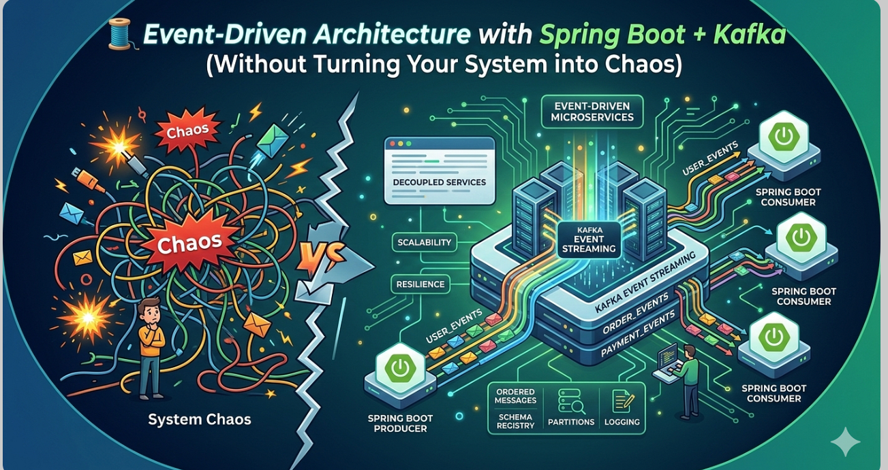

This architecture delivers exactly-once processing across a globally distributed event hub by combining idempotent producers/consumers, Kafka transactions, deterministic state transitions, and an immutable audit ledger—ensuring financial correctness at scale while maintaining high availability and regulatory compliance.

**Future of Event-Driven Architectures**

As event-driven architectures (EDA) mature into the foundational pattern for real-time, responsive systems, the coming years—particularly 2025–2026 and beyond—will see profound evolution driven by AI integration, serverless maturity, edge proliferation, and the demands of autonomous, decentralized intelligence. EDA shifts from reactive plumbing to proactive, intelligent fabric enabling adaptive enterprises where systems anticipate, decide, and act without human intervention.

**Emerging Trends**

**Serverless Event Processing**

Serverless computing and EDA converge to create truly elastic, zero-ops event pipelines. By 2026, serverless platforms evolve beyond simple FaaS to support complex stateful workflows, reduced cold starts (via WebAssembly and provisioned concurrency), and seamless integration with streaming backends.

Event-driven functions handle high-throughput triggers (IoT signals, API events, data changes) with consumption-based pricing and auto-scaling to zero. Cloud providers enhance orchestration (e.g., serverless workflows) for multi-function sagas, while open standards reduce lock-in. This democratizes EDA for enterprises, enabling rapid prototyping of real-time applications without infrastructure overhead.

**AI-Driven Stream Optimization**

AI infuses EDA with predictive intelligence: models optimize routing, detect anomalies in-flight, enrich events, and trigger autonomous actions. Stream processing engines (Flink, Kafka Streams) embed multimodal AI for real-time inference on data in motion—fraud scoring, predictive maintenance, personalized recommendations.

Event-driven agentic AI emerges, where autonomous agents subscribe to streams, reason over events, and publish outcomes in feedback loops. EDA becomes the runtime for agent meshes: declarative workflows compile to event-driven functions, with streaming joins, time windows, and orchestration ensuring reliability. This powers proactive systems that self-heal, adapt, and scale intelligence across distributed environments.

**Autonomous Event Routing**

Intelligent, self-managing routing replaces static topologies. AI/ML models dynamically route events based on latency, cost, load, or semantics—optimizing paths in real time. Multi-agent systems coordinate routing decisions, while event meshes (distributed fabrics) enable seamless propagation across clouds, regions, and boundaries.

In autonomous setups, routing incorporates policy-as-code, compliance checks, and resilience heuristics, reducing manual configuration and enabling zero-trust, adaptive networks.

**Decentralized Event Networks**

Blockchain-inspired and peer-to-peer models gain traction for trustless, tamper-proof event flows. Decentralized event buses use cryptographic chaining, distributed ledgers, or CRDTs for global consistency without central brokers.

This supports federated EDA in regulated industries (finance, supply chain) or IoT swarms, where nodes route and validate events autonomously. Emerging protocols combine EDA with consensus mechanisms for immutable, auditable streams across untrusted participants.

**Edge Event Processing**

With IoT exploding (billions of devices by 2025–2026), edge computing shifts processing closer to sources for sub-millisecond latency and bandwidth efficiency. Edge AI runs lightweight models on devices/gateways, filtering or enriching events before upstream propagation.
Hybrid architectures blend edge (real-time decisions) with cloud (global aggregation), supporting autonomous vehicles, industrial automation, smart cities. Trends include TinyML evolution to multimodal models, secure edge orchestration, and low-power connectivity (NB-IoT, Wi-Fi HaLow).


Event-driven microservices have proven indispensable for building scalable, resilient, real-time systems that thrive amid uncertainty. Core requirements remain:

Strong consistency guarantees — Through transactional boundaries and deterministic reconciliation.

Reliable distributed logs — As immutable foundations for replay, auditing, and recovery.

Idempotent processing — To safely handle duplicates inherent in at-least-once delivery.

Fault-tolerant architectures — Via checkpoints, snapshots, replication, and autonomous recovery.

These elements—layered with observability, security, and emerging intelligence—form the resilient backbone of modern distributed applications.

Exactly-once processing is not achieved through a single mechanism but through a carefully designed combination of idempotency, transactional messaging, deterministic state management, and distributed consensus. As EDA evolves into intelligent, autonomous, edge-native fabrics, this compositional approach will power the next generation of adaptive, planet-scale systems—where events don't just notify, but drive proactive intelligence at every layer.


